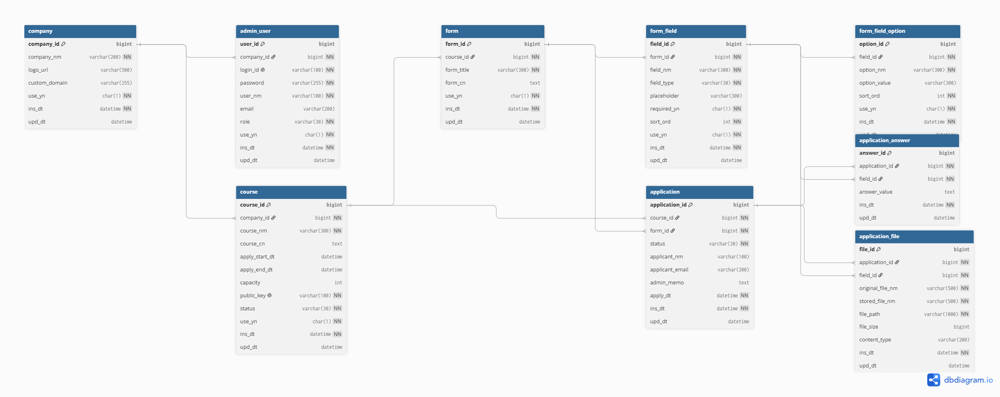

# ERD

## 전체 ERD

## 주요 테이블

- `company`: 고객사 정보
- `admin_user`: 고객사 관리자 계정
- `course`: 행사/강좌 정보
- `form`: 신청 폼
- `form_field`: 폼 항목
- `form_field_option`: 선택형 항목의 옵션
- `application`: 신청자 기본 정보
- `application_answer`: 신청 항목별 답변
- `application_file`: 첨부파일